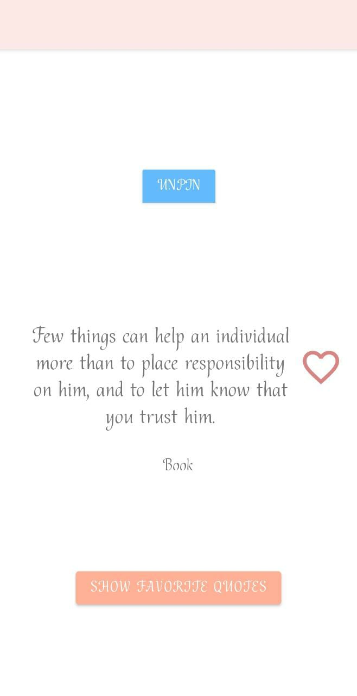

# My Quote App

## Description

My Quote App is a Java application that retrieves quotes from an API and provides features for liking, saving favorites, and pinning quotes.

## Features

- Fetches quotes from a selected API
- Displays random quotes with the quote text and author
- Allows users to like or dislike quotes
- Enables users to save their favorite quotes
- Provides the ability to pin a quote as a favorite or reminder

## Usage
- Launch the application.

- The app will fetch a random quote from the API and display it on the screen.

- Users can click the "Like" heart to indicate their preference for a quote.

- Users can save their favorite quotes by clicking the "Save" button.

- To pin a quote, click the pin button associated with the quote.

## Screenshots

___

Favorite Quotes *(List View)* : 

___

Favorite Quotes *(Grid View)* : 

